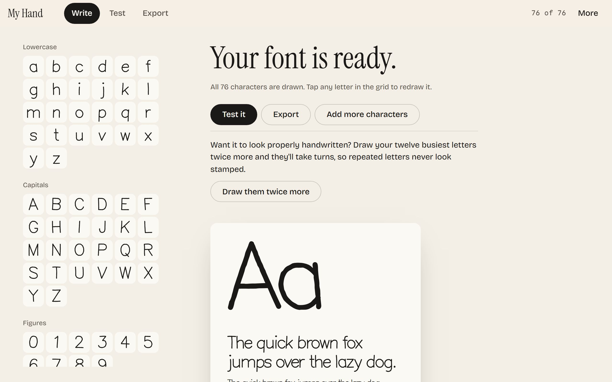

# Handwriting Font Maker

I built this to turn your handwriting into a real font, in the browser. You write each letter on your phone, with a mouse, or on a printed template you photograph, and download a font that installs on an iPhone, Mac or PC. There's no account and no server, and nothing you draw leaves your device.

The tools I found for this wanted an account, a printer and a scanner, or an iPad app, and their free tiers stopped well short of a full font. I wanted to see how far a phone browser could go on its own, from a fingertip to a font file that Word, Pages and Procreate will install.

## What it does

- Spaces and kerns your letters for you.
- Lets you draw your busiest letters up to three times, so repeats take turns and the text doesn't look stamped.
- Joins pairs like *th* the way you actually write them.
- Exports OTF, TTF, WOFF2 and WOFF, a one-tap install profile for iPhone and iPad, CSS for a website, and typed text as a PNG or SVG.

## How I made it

- A **Vite** multi-page site: a static home page with one small React island, and the studio as a **React** app, in strict **TypeScript**.
- I wrote most of the font file myself. `src/core/font/` writes the TrueType outlines, the GSUB and GPOS layout tables, a legacy `kern` table so older Windows apps kern too, and WOFF2 with its own Brotli stream. **opentype.js** assembles the CFF outlines.
- **Web Workers** (through **Comlink**) turn strokes into outlines and build the font, so drawing never waits on them.
- **perfect-freehand** draws the ink, **Clipper2** merges each letter's strokes into one outline, and **fit-curve** fits the Bézier curves.
- **js-aruco2** finds the markers on a photographed template, then my own perspective and lighting correction straighten and flatten the page.
- **Zustand** for state, **Motion** for animation, **Paper Shaders** for the background, **idb-keyval** for autosave and **fflate** for zips.
- Hosted on **Cloudflare Pages**.

## Credits and licences

| What | Licence |
|---|---|
| [Instrument Serif](https://github.com/Instrument/instrument-serif), [Bricolage Grotesque](https://github.com/ateliertriay/bricolage), [Martian Mono](https://github.com/evilmartians/mono) (via Fontsource) | SIL Open Font License 1.1 |
| [React](https://react.dev), [Motion](https://motion.dev), [Zustand](https://github.com/pmndrs/zustand), [opentype.js](https://github.com/opentypejs/opentype.js), [perfect-freehand](https://github.com/steveruizok/perfect-freehand), [fit-curve](https://github.com/soswow/fit-curve), [fflate](https://github.com/101arrowz/fflate), [js-aruco2](https://github.com/damianofalcioni/js-aruco2) | MIT |
| [Comlink](https://github.com/GoogleChromeLabs/comlink), [Paper Shaders](https://github.com/paper-design/shaders), [idb-keyval](https://github.com/jakearchibald/idb-keyval), [brotli-wasm](https://github.com/httptoolkit/brotli-wasm) | Apache 2.0 |
| [Clipper2 (TypeScript port)](https://github.com/countertype/clipper2-ts) | Boost Software License 1.0 |
